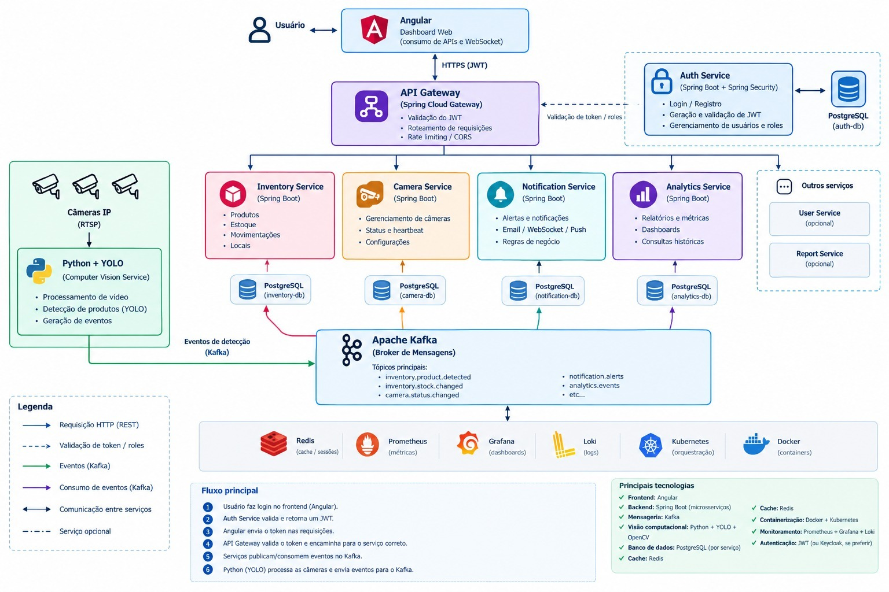

# StockVision — Inventory Service


Microserviço responsável pelo gerenciamento de estoque e registro de movimentações de inventário do **StockVision**, uma plataforma de monitoramento de estoque em tempo real utilizando processamento de imagens e câmeras.

---

## Arquitetura

O StockVision utiliza uma arquitetura baseada em **microsserviços e comunicação orientada a eventos**.



### Fluxo de movimentação

```text
Camera
   │
   ▼
Inventory Service
   │
   ├── PostgreSQL
   │
   └── Kafka
         │
         ▼
    Stock Service
         │
         ▼
   Atualização do estoque
```

A movimentação é inicialmente registrada pelo **Inventory Service**. Após persistir a operação, um evento `StockMovementCreatedEvent` é publicado no Kafka.

O **Stock Service** consome esse evento e atualiza o estoque correspondente de forma assíncrona.

---

## Tecnologias

| Tecnologia      | Utilização                    |
| --------------- | ----------------------------- |
| Java            | Linguagem principal           |
| Spring Boot     | Framework principal           |
| Spring Data JPA | Persistência                  |
| Spring Kafka    | Comunicação assíncrona        |
| PostgreSQL      | Banco de dados                |
| Flyway          | Migrations                    |
| MapStruct       | Mapeamento DTO ↔ Entity       |
| Lombok          | Redução de boilerplate        |
| Docker          | Containerização               |
| Maven           | Gerenciamento de dependências |

---
